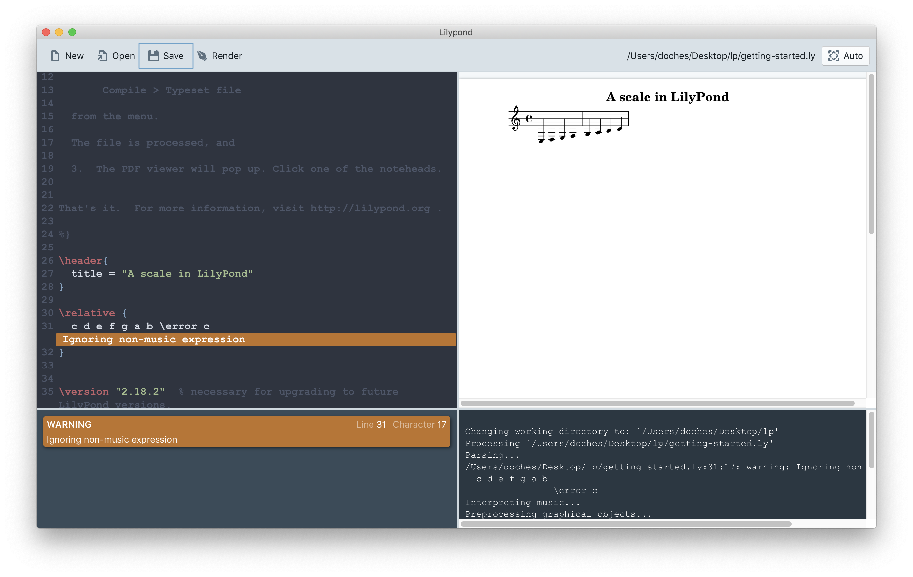

# LilyPond-UI

> A stylish, easy-to-use editor for LilyPond.

[LilyPond](http://lilypond.org) is a fantastic tool for typesetting beautiful musical scores, but its learning curve is _tremendous_. LilyPond-UI makes writing &amp; editing scores in LilyPond easier by providing a set of easy-to-use features in one package:

   * Syntax highlighting
   * In-line error and warning messages
   * Adjustable two-up code and preview windows
   * Easy access to the raw LilyPond output, for debugging

### Getting Started

1. Install the OS X build of LilyPond from [http://lilypond.org/macos-x.html](http://lilypond.org/macos-x.html)
2. Download [LilyPond Editor.dmg](https://texasexpat.net/LilyPond%20Editor.dmg)
3. Open `LilyPond Editor.dmg` and drag **LilyPond Editor.app** into your `Applications` folder
4. Launch `LilyPond Editor`, open a score, and write!

### Useful Commands

* Quickly save &amp; render the open score with `⌘s`
* To just re-render the file (without saving any changes), hit `⌘r`
